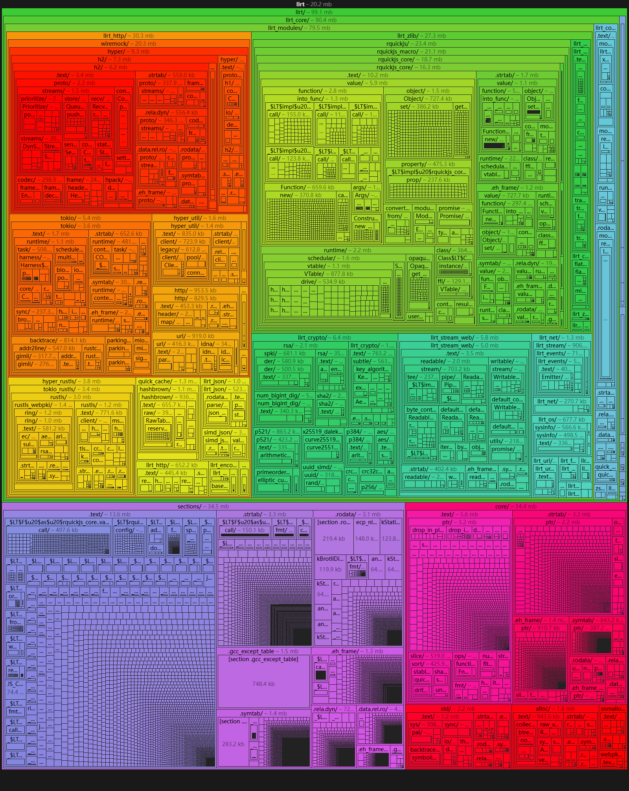

Cli tool: convert metafile.json to image through
[puppeteer](https://github.com/puppeteer/puppeteer)

```bash
pnpm i metafile-image -g

metafile-image meta.json meta.png

metafile-image meta.json meta.webp -w 1920 -h 1080 -q 100 --mode=dark --type=sunburst
```

## Options

### width, height

**Default:** `3840x2160`

Specifies the width and height of the browser viewport.

### mode

**Values:** `light` / `dark`

Determines whether the browser operates in light or dark mode.

### quality

**Default:** `100`

Defines the image quality when exporting. The value ranges from `0` (lowest
quality) to `100` (highest quality).

### url

**Values:** string

**Default:** `https://esbuild.github.io/analyze/`

Customize esbuild analyze url


### type

**Default:** `"treemap"` **Values:** `treemap` | `sunburst` | `flame`

Specifies the visualization type. The default value is `"treemap"`.

#### treemap



#### sunburst


#### flame


